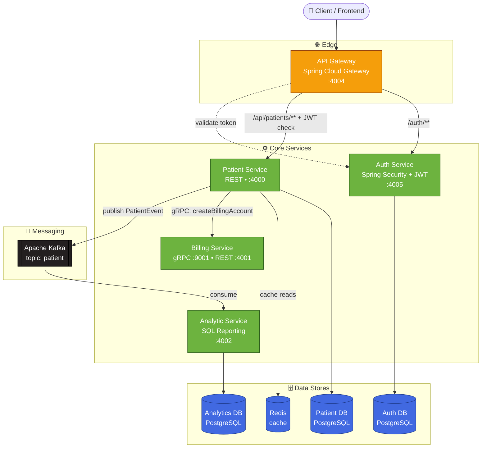
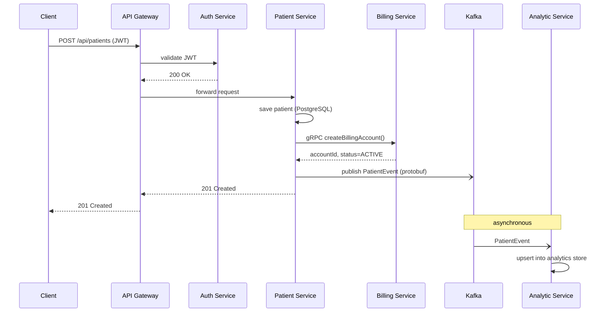
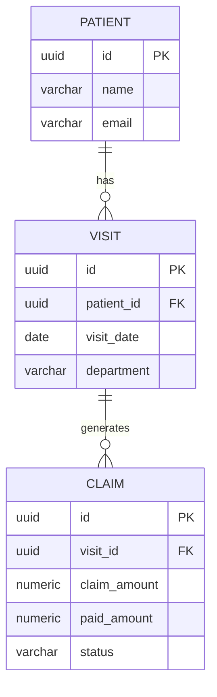
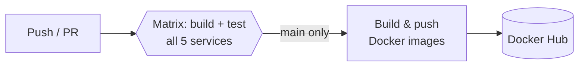

<div align="center">

# 🏥 Patient Management — Microservices Platform

**A production-style, event-driven healthcare backend built with Spring Boot microservices, gRPC, Kafka, and PostgreSQL — deployed on Kubernetes with a full CI/CD pipeline and observability stack.**

[](https://github.com/amitsaini1912/patient-management-microservices/actions/workflows/ci.yml)


</div>

---

## 📑 Table of Contents

- [What is this?](#-what-is-this)
- [System Architecture](#-system-architecture)
- [How a Request Flows](#-how-a-request-flows)
- [The Services](#-the-services)
- [Tech Stack](#-tech-stack)
- [The Analytics Layer (SQL Deep-Dive)](#-the-analytics-layer-sql-deep-dive)
- [Infrastructure & DevOps](#-infrastructure--devops)
- [Getting Started](#-getting-started)
- [API Overview](#-api-overview)
- [What I Learned](#-what-i-learned)
- [Roadmap / What's Next](#-roadmap--whats-next)
- [Project Structure](#-project-structure)

---

## 🎯 What is this?

This is a **backend platform for managing patients, billing, and healthcare analytics**, built the way real systems are built: as a set of small, independently deployable services that talk to each other over **REST, gRPC, and Kafka events**.

It started as a learning project and grew into a full walkthrough of modern backend engineering — from writing the first integration test to running the whole thing on Kubernetes with persistent storage, circuit breakers, caching, monitoring, and an analytics service that answers real reporting questions with SQL window functions.

**In one sentence:** a client registers a patient → the patient service saves it, calls the billing service over gRPC, and publishes a Kafka event → the analytics service consumes that event and builds a read-optimized reporting store.

---

## 🏗 System Architecture



**Key design decisions**

| Concern | Choice | Why |
|---|---|---|
| Synchronous, low-latency internal call | **gRPC** (patient → billing) | Strongly-typed contract via Protobuf, fast binary transport |
| Asynchronous, fire-and-forget | **Kafka** (patient → analytics) | Decouples services; analytics can be down without blocking patient creation |
| Public entry point | **API Gateway** | One door, central routing, JWT validation before requests reach services |
| Read-heavy analytics | **Separate OLAP-style DB** | Reporting queries never touch (or slow down) the transactional patient DB |
| Resilience | **Resilience4j circuit breaker** | Patient service degrades gracefully if billing is unavailable |

---

## 🔄 How a Request Flows

Creating a patient touches **three services and two data stores** — synchronously *and* asynchronously:



The **solid arrows are synchronous** (the client waits). The **dashed/`-)` arrows are asynchronous** — the client already got its `201` before analytics even sees the event. That's the whole point of the Kafka split.

---

## 🧩 The Services

| Service | Port | Responsibility | Highlights |
|---|---|---|---|
| **api-gateway** | `4004` | Single entry point, routing, auth enforcement | Spring Cloud Gateway (reactive), custom `JwtValidation` filter, path rewriting for aggregated Swagger docs |
| **auth-service** | `4005` | Login, JWT issuing & validation | Spring Security, JJWT, PostgreSQL-backed users |
| **patient-service** | `4000` | Patient CRUD — the heart of the system | REST + validation, Redis caching, **gRPC client** to billing, **Kafka producer**, Resilience4j **circuit breaker**, Flyway migrations, Actuator/Prometheus metrics, OpenAPI docs |
| **billing-service** | `4001` REST / `9001` gRPC | Billing accounts | **gRPC server** implementing the Protobuf contract |
| **analytic-service** | `4002` | Healthcare reporting & analytics | **Kafka consumer**, own PostgreSQL analytics store, **SQL window-function reports**, N+1 vs `JOIN FETCH` demo |

---

## 🛠 Tech Stack

**Languages & Frameworks**
`Java 21` · `Spring Boot 3.4` · `Spring Cloud Gateway` · `Spring Security` · `Spring Data JPA / Hibernate`

**Communication**
`REST` · `gRPC + Protocol Buffers` · `Apache Kafka` (protobuf-serialized events)

**Data**
`PostgreSQL 16` · `Flyway` (versioned schema migrations) · `Redis` (caching) · `H2` (test databases)

**Resilience & Observability**
`Resilience4j` (circuit breaker) · `Spring Boot Actuator` · `Micrometer` · `Prometheus` · `Grafana`

**Infrastructure & DevOps**
`Docker` · `Kubernetes` (Deployments, StatefulSet, PVCs, Secrets) · `GitHub Actions` (CI/CD)

> ☁️ AWS infrastructure-as-code (CDK on LocalStack) also lives in the repo but is a **work in progress** — see [In Progress & Actively Learning](#-in-progress--actively-learning).

**Testing**
`JUnit 5` · `Testcontainers` (real PostgreSQL in tests) · `Spring Boot Test` · integration test suite

---

## 📊 The Analytics Layer (SQL Deep-Dive)

The `analytic-service` is where the SQL lives. It keeps its own read-optimized store (`patient` → `visit` → `claim`) and answers real reporting questions.



**Reporting endpoints** (`/analytics/...`) and the SQL technique each one demonstrates:

| Endpoint | Question it answers | SQL technique |
|---|---|---|
| `GET /analytics/revenue-by-department` | Which department has the most unrecovered revenue? | `JOIN` + `GROUP BY` + aggregate math |
| `GET /analytics/denial-rate-by-department` | Which departments deny the most claims? | Conditional aggregation (`SUM(CASE WHEN ...)`) |
| `GET /analytics/revenue-ranking` | Rank departments by revenue | **`RANK() OVER (...)` window function** |
| `GET /analytics/monthly-trend` | Running total & month-over-month change | **CTE + `SUM() OVER`, `LAG()`, `DATE_TRUNC`** |
| `GET /analytics/claims-naive/{status}` | *(demo)* the **N+1 query problem** | lazy loading — one query per claim |
| `GET /analytics/claims-fetch/{status}` | *(demo)* the **fix** | `JOIN FETCH` — one query total |

Schema is built and versioned with **Flyway** (`V1` tables → `V2` seed → `V3` composite index on `visit(department, visit_date)` — equality column first, range column second, so the index can seek then range-scan).

---

## 🚀 Infrastructure & DevOps

### CI/CD — GitHub Actions
Every push and PR runs a **matrix build**: all five services are compiled and tested in parallel (`./mvnw -B verify`). On merge to `main`, each service's Docker image is built and pushed to Docker Hub, tagged with both `latest` and the commit SHA.



### Kubernetes
The full stack runs on Kubernetes:
- **Deployments** for every service, **Services** for internal networking
- **StatefulSet + PersistentVolumeClaims** for the patient database, so data survives pod restarts
- **Secrets** for credentials, plus Kafka and Redis workloads

### Monitoring
`monitoring/prometheus.yml` scrapes the services' Actuator/Micrometer endpoints; metrics are visualized in **Grafana** (circuit-breaker state, request metrics, JVM health).

---

## 🏁 Getting Started

### Prerequisites
- **JDK 21**
- **Docker** (for running dependencies and Testcontainers-based tests)
- **Maven** (each service ships the `./mvnw` wrapper — no local install needed)

### Build & test a single service
```bash
cd patient-service
./mvnw -B verify          # compiles + runs tests (spins up PostgreSQL via Testcontainers)
```

> **Note:** tests are self-contained. `patient-service` uses Testcontainers (real PostgreSQL), while `analytic-service` and `auth-service` boot their context on in-memory **H2**, so CI needs no external database.

### Run the whole stack
- **Locally:** each service has a `Dockerfile`; build the images and run them alongside PostgreSQL, Redis, and Kafka.
- **On Kubernetes:** apply the manifests in [`k8s/`](k8s/):
  ```bash
  kubectl apply -f k8s/
  ```

### Explore the APIs
Aggregated Swagger UI is exposed through the gateway (`/api-docs/patients`, `/api-docs/auth`). Sample requests live in [`api-requests/`](api-requests/) and [`grpc-requests/`](grpc-requests/).

---

## 📡 API Overview

| Via Gateway (`:4004`) | Method | Description | Auth |
|---|---|---|---|
| `/auth/login` | `POST` | Authenticate, receive a JWT | ❌ |
| `/api/patients` | `GET` / `POST` | List / create patients | ✅ JWT |
| `/api/patients/{id}` | `PUT` / `DELETE` | Update / delete a patient | ✅ JWT |

> The `analytic-service` reporting endpoints (`/analytics/*`, see the SQL table above) are served **directly by the service on `:4002`** and are not currently exposed through the gateway.

---

## 🎓 What I Learned

This project doubles as a structured learning journal — each "day" added one real capability and is written up in [`learning-notes/`](learning-notes/):

| Day | Topic | What it added to the project |
|---|---|---|
| 1 | **Testing** | Integration tests with Testcontainers (real PostgreSQL, not mocks) |
| 2 | **Redis Caching** | Cached patient reads; learned cache-aside & TTLs |
| 3 | **Resilience4j Circuit Breaker** | Patient service survives a down billing service |
| 4 | **Prometheus + Grafana** | Metrics, dashboards, and health visibility |
| 5 | **GitHub Actions CI/CD** | Automated matrix build/test + Docker image publishing |
| 6 | **Kubernetes** | Deployed the full stack to a cluster |
| 7 | **K8s Persistent Storage** | StatefulSet + PVCs so DB data survives restarts |
| 8 | **Database Schema + Flyway** | Versioned migrations; visit + claim schema |
| 9 | **Analytics SQL** | A real analytics DB with SQL reporting endpoints |
| 10 | **Window Functions + Indexing** | `RANK()`, `LAG()`, running totals, composite indexes |
| 11 | **Transactions, Dual-Write & N+1** | The N+1 problem and its `JOIN FETCH` fix |

**The big ideas I can now explain and defend:** why gRPC *and* Kafka (not just one), how a circuit breaker actually protects a caller, why analytics gets its own database, how a composite index's column order matters, and how to read a slow query and fix an N+1.

---

## 🚧 In Progress & Actively Learning

Two areas are **intentionally marked "in progress."** I've started them, but I'm still deepening my understanding — so rather than present them as finished, production-grade work, I'm being upfront about where they stand.

### ☁️ AWS Infrastructure-as-Code (CDK + LocalStack)
`infrastructure/` contains an AWS **CDK** stack (written in Java) that models cloud infrastructure — a VPC, **ECS Fargate** services, **RDS** PostgreSQL instances, an **MSK** (managed Kafka) cluster, and Route 53 health checks — and runs it against **LocalStack**, a mock AWS that runs on your own machine, so there's no real cloud account or cost involved.

> **What it means in plain terms:** instead of clicking around the AWS console to create servers and databases, you describe them *in code*; the CDK turns that code into the actual cloud resources. LocalStack lets you test all of that locally first.
>
> **Status:** the stack exists and synthesizes. I'm currently working through *why* each piece is there and how it maps to real AWS before deploying to a live account — so I'm keeping it out of the "done" list until I can explain every part of it.

### 📤 Transactional Outbox Pattern
Today, `patient-service` does a **dual write**: in one flow it saves the patient to PostgreSQL **and** publishes a Kafka event. If the app crashes *between* those two steps, the database and Kafka drift out of sync — the patient exists but the event never fired (or vice-versa).

> **The fix:** the outbox pattern writes the event into an `outbox` table **inside the same database transaction** as the patient. Either both commit or neither does. A separate relay then reads the outbox and publishes to Kafka — guaranteeing the event is sent **if and only if** the data was committed.
>
> **Status:** designed, not yet built. This is my planned replacement for the current dual-write (which I document honestly in the Day 11 notes).

---

## 🗺 Roadmap / What's Next

Planned additions (in rough priority order):

- [ ] **Transactional outbox** to replace the current dual-write (see [In Progress](#-in-progress--actively-learning))
- [ ] **Testcontainers integration test for `analytic-service`** — run the window-function queries against real PostgreSQL 16 (H2 can't validate Postgres-specific SQL)
- [ ] **Persist real billing logic** in `billing-service` (currently a stubbed gRPC response) with its own database
- [ ] **Event-driven ETL** — stream `visit`/`claim` changes into the analytics store via Kafka instead of seed data
- [ ] **Auth hardening** — refresh tokens and role-based access control (RBAC)
- [ ] **Distributed tracing** — Grafana Tempo / OpenTelemetry across the gRPC + Kafka hops
- [ ] **Centralized logging** — Loki or ELK for cross-service log correlation
- [ ] **Gateway rate limiting** and request quotas
- [ ] **Deploy to real AWS** — once the CDK stack is fully understood, promote it from LocalStack to a live account
- [ ] **Grafana dashboards as code** — version the dashboards alongside the app

---

## 📂 Project Structure

```
patient-management/
├── api-gateway/         # Spring Cloud Gateway — routing + JWT validation (:4004)
├── auth-service/        # Authentication & JWT issuing (:4005)
├── patient-service/     # Core CRUD, gRPC client, Kafka producer, caching (:4000)
├── billing-service/     # gRPC server for billing accounts (:9001 / :4001)
├── analytic-service/    # Kafka consumer + SQL analytics store (:4002)
├── infrastructure/      # AWS CDK (LocalStack) — VPC, ECS, RDS, MSK   🚧 in progress
├── k8s/                 # Kubernetes manifests (Deployments, StatefulSet, PVCs, Secrets)
├── monitoring/          # Prometheus config (Grafana dashboards)
├── integration-tests/   # Cross-service end-to-end tests
├── api-requests/        # Sample HTTP requests
├── grpc-requests/       # Sample gRPC requests
├── learning-notes/      # Day-by-day write-ups of everything above
└── .github/workflows/   # CI/CD pipeline
```

---

<div align="center">

**Built by [Amit Saini](https://github.com/amitsaini1912)** · Java / Spring Boot backend engineer

*If this project helped or interested you, consider giving it a ⭐*

</div>